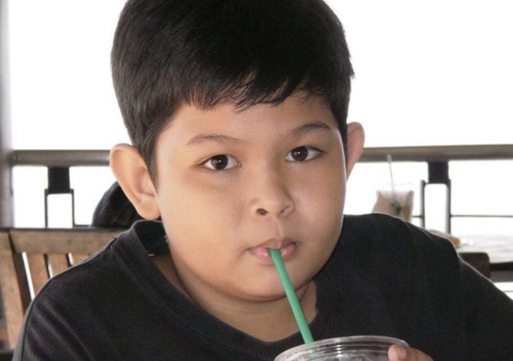
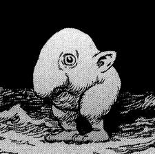

  

      

        We are team 7 and our application is DEAP, an emergency utility to help people stay informed and find safety during natural disasters. Our group consisted of Brian Adams, James Giatpaiboon, Juan Aguirre, Kenneth Chuson and Nicholas Shaffer. The application design was a group effort, and everyone had input on just about every page. With that being said Brian focused on reaching out to those affected by the Carr fire and Fawn fire in Northern California, and spent the most time designing the landing page and the menu. ----
      

            
      

        It is estimated that almost 102 million people were affected by natural disasters in 2021 worldwide. As climate change accelerates extreme weather patterns, so too will more and more communities be put at risk. Our application DEAP is aimed at mediating the impact that disasters have on our lives by offering up to minute information from reliable sources in the community, as well as providing guidance for evacuation. The primary focus for this application is getting users life saving information as quickly and reliably as possible. DEAP also offers a community section where members of the local community can leave comments on maps that can provide even more context to events happening in their surrounding area. 
      

      

          Our design goal is a very simple UI, that makes both providing updates, and receiving updates as intuitive as possible. We have accomplished this by identifying the critical parts of our application and used accent colors, white space and effective font choices to help users identify important information in stressful situations. Our color scheme involves using warm colors to draw the user's attention to the most important sections, and cooler grays to highlight useful, but less critical data.
      

  

    

      
      

        <h2>Brian Adams</h2>
        

          Hello, my name is Brian and I'm a senior at SFSU studying Computer Science. I'm interested in full stack development and plan on developing web apps when I graduate. I really enjoy working with web technologies because of the flexibility the platform offers, and the speed at which the industry evolves. My preferred stack is React/NextJS, TypeScript, Node, Express, and SQL.
        

        
badams2@mail.sfsu.edu

      

    

    

      
      

        <h2>James Giatpaiboon</h2>
        
Aspiring Computer Scientist - Senior

        
jgiatpaiboon@mail.sfsu.edu

      

    

    

      
      

        <h2>Juan Aguirre</h2>
        
Some text that describes me lorem ipsum ipsum lorem.

        
example@example.com

      

    

    

      
      

        <h2>Kenneth Chuson</h2>
        
Hello my name is Kenneth, I am interested in full stack development and exploring different problems and learn new things in life.

        
kchuson@mail.sfsu.edu

      

    

    

      
      

        <h2>Nicholas Shaffer</h2>
        
When i'm not busy with school, I like to play video games, exercise, and listen to podcasts.

        
nshaffer1@mail.sfsu.edu

      

    

  

      

        We are interested in natural disasters. We’ve seen that natural disasters are the most critical issue in people's lives and we are     planning to develop an application to decrease the number of deaths from the natural disasters as possible.
      

  

